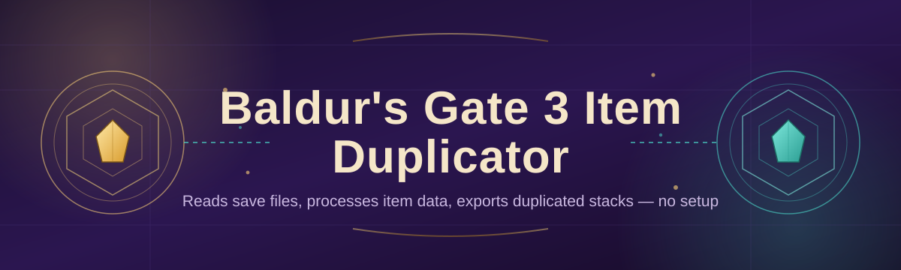

# bg3-item-duplicator-tool 🗝️✨

  

*Clone your gear, not your grind — a save-file item duplicator built for Baldur's Gate 3 hoarders.*

---

## 🚀 Quick Start

1. Hit the **DOWNLOAD NOW** button below and grab the latest build from the landing page.

2. Extract the folder anywhere — no installer, no setup wizard.

3. Launch `bg3-item-duplicator-tool.exe`, point it at your save, pick an item, duplicate.

> [!TIP]
> Back up your save folder before your first run. Always. It takes ten seconds and saves you an evening.

---

## 📖 Overview

Baldur's Gate 3 rewards curiosity and punishes inventory management. You find the perfect set of armor for a build you're theory-crafting, but respeccing means you might lose access to it, or you want one on every party member without four separate fetch quests. **bg3-item-duplicator-tool** exists to close that gap — a focused, standalone utility that reads your save data and lets you clone items you've already legitimately found, so your camp chest stops being a bottleneck between you and the build you actually want to play.

This isn't a save editor trying to be everything at once. It's a scalpel, not a Swiss army knife. The tool is built for players who care about consumables math (how many Elixirs of the Colossus is *enough*?), for min-maxers who want a full set of +2 Rations for every companion, and for completionists who'd rather spend their time in combat than backtracking to Act 1 vendors. Whether you're on your fourth Honour Mode run or just tired of hoarding camp supplies like a dragon, this tool trims the busywork so you can focus on the actual RPG.

Built specifically around the 2026 patch save structure, it stays lightweight, dependency-free, and laser-focused on one job: duplicating items cleanly, without corrupting the rest of your save state.

  

---

## 🎒 What It Actually Does

- **Item cloning, precisely.** Select any item in your inventory or camp chest and spin off exact copies — same stats, same rarity, same flavor text.

- **Batch duplication.** Need 20 Smokepowder Bombs? Set a quantity once and let the tool iterate instead of you clicking twenty times.

- **Save-safe writes.** Every duplication pass writes to a working copy first, then commits — your original save is never touched mid-operation.

- **Companion-aware inventory browsing.** Pull items from any party member's bag, not just the active character, without swapping control in-game first.

- **Rarity and tag filtering.** Search your whole inventory by rarity, item type, or name fragment instead of scrolling through hundreds of scrolls and potions.

- **Undo-friendly workflow.** Automatic pre-duplication snapshots mean a bad batch is one click away from being reversed.

- **Portable operation.** Runs from a USB stick or any folder — no registry writes, no background services.

- **Dark and light UI themes.** Because Baldur's Gate 3 modding tools shouldn't burn your retinas at 2 a.m.

> [!NOTE]
> The tool works on decoded save data only. It does not touch Larian's servers, multiplayer sessions, or Steam Cloud sync directly — you control when saves get written.

---

## 🧭 Getting Started, Step by Step

1. **Visit the landing page.** Click any DOWNLOAD NOW button on this page — it's the only official download source.

2. **Download and extract.** The tool ships as a single portable folder. No installer runs, no admin prompt needed.

3. **Point it at your save.** On first launch, browse to your BG3 save directory (usually under your Documents\Larian Studios\Baldur's Gate 3\PlayerProfiles folder).

4. **Duplicate and save.** Pick your item, set a quantity, hit Duplicate, then load the save in-game like normal.

---

## 💻 System Requirements

| Requirement | Detail |
|---|---|
| OS | Windows 10 or Windows 11 (64-bit) |
| Dependencies | None — fully standalone executable |
| Disk space | Under 100 MB |
| Game version | Baldur's Gate 3, 2026 patch branch |
| Admin rights | Not required |

  

---

## ⚙️ How It Works

1. **Load** — the tool reads your selected save file and decodes its item and inventory structures.

2. **Index** — every item across every character and container gets mapped into a searchable list.

3. **Select** — you pick the target item and how many copies you want.

4. **Write** — the tool clones the item's data block and re-injects it into the chosen inventory slot.

5. **Verify** — a checksum pass confirms the save is structurally sound before it's marked ready to load.

> [!IMPORTANT]
> Always close Baldur's Gate 3 completely before writing changes. Duplicating into a save while the game holds a lock on it is the #1 cause of failed writes.

---

## 🧩 Troubleshooting

<strong>The tool says my save file is "locked" or "in use."</strong>

Close Baldur's Gate 3 fully, including any background launcher process, then retry.

<strong>My duplicated items don't show up in-game.</strong>

Make sure you loaded the save the tool actually wrote to, not an autosave created after your last game session. Save slot mismatches are the usual culprit.

<strong>Can I duplicate quest items?</strong>

Quest items are filtered out by default to prevent story-flag corruption. Advanced mode can override this, but expect unpredictable scripted-event behavior.

<strong>The app won't launch on my machine.</strong>

Confirm you're on Windows 10/11 64-bit and that antivirus hasn't quarantined the executable — flag it as an exception if needed.

<strong>Does this work with Honour Mode saves?</strong>

Technically yes, structurally. Whether you *should* is between you and your conscience.

> [!WARNING]
> Duplicating unique legendary items in large quantities can visually clutter your inventory UI and, in rare cases, slow save-load times. Duplicate responsibly.

---

## 🎨 UI & UX Details

- **Themes:** Dark (default) and Light, toggled from the settings gear.

- **Keyboard shortcuts:**

  | Action | Shortcut |
  |---|---|
  | Duplicate selected item | `Ctrl + D` |
  | Search inventory | `Ctrl + F` |
  | Undo last write | `Ctrl + Z` |
  | Refresh save data | `F5` |

- **Settings persistence:** All preferences save locally to a config file next to the executable — nothing phones home.

- **Multi-language item names:** Displays item names in whatever language your BG3 install uses.

---

## 🤝 Contributing & Community

> [!TIP]
> Found an item type that doesn't duplicate cleanly? Open an issue with your save's patch version and item name — reproducible reports get fixed fastest.

Contributions are welcome via pull requests — bug fixes, UI polish, and documentation improvements all count. Before submitting:

- Test against a fresh save and a heavily modded save if possible.

- Keep PRs focused — one fix or feature per PR.

- Describe *what* changed and *why* in the description, not just *what*.

Community discussion, build sharing, and troubleshooting help live in the repository's Discussions tab and Issues board.

---

## 📜 License

Released under the [MIT License](LICENSE), 2026.

---

## ⚖️ Disclaimer

> This tool is an independent, fan-made utility. It is not affiliated with, endorsed by, or associated with Larian Studios. It modifies local save files only. Use it on single-player or offline saves, back up your data first, and understand that manual inventory edits fall outside standard game support. Use at your own risk.

---

## 🕰️ Changelog

**v2026.3**
- Added batch duplication with quantity presets
- Fixed checksum false-positive on modded saves
- New Light theme

**v2026.2**
- Companion inventory browsing across full party
- Improved save-write speed by ~40%
- Undo snapshot system introduced

**v2026.1**
- Initial 2026 patch-branch compatibility
- Core duplication engine rewritten for new save schema
- Rarity and tag filtering added

  

